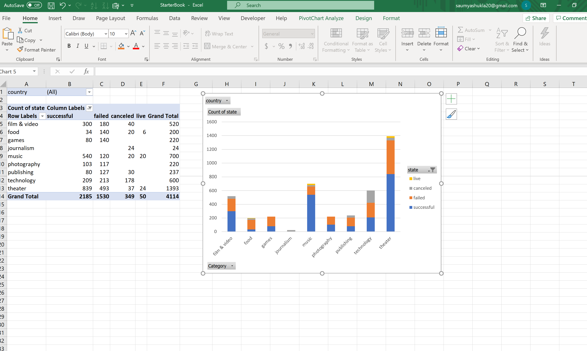
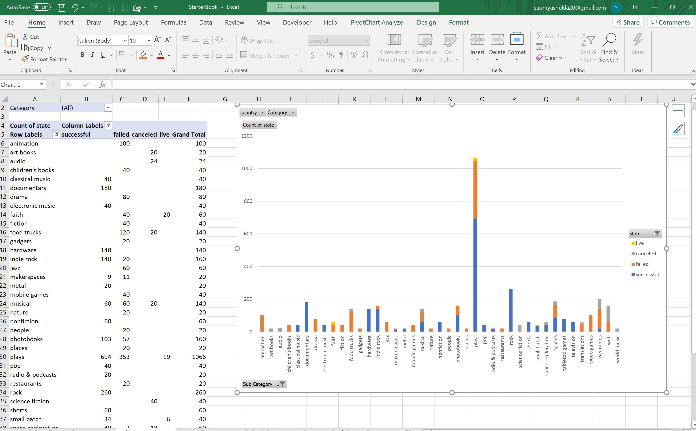
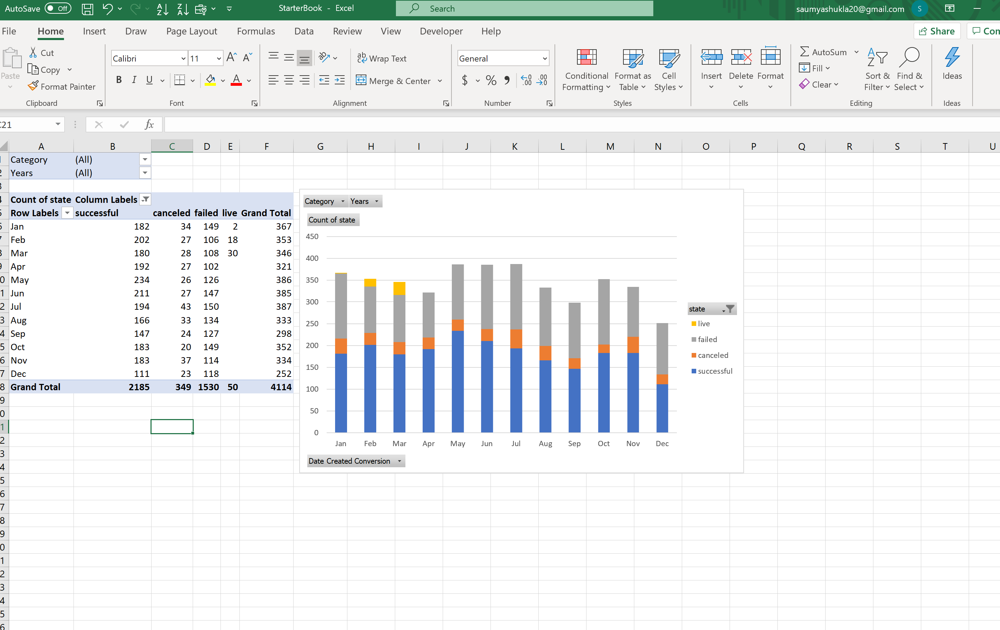
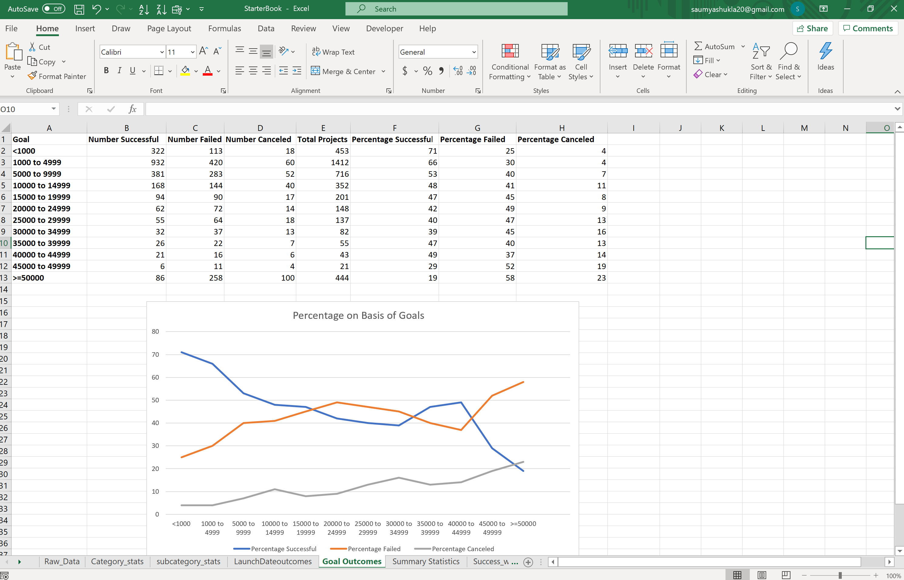
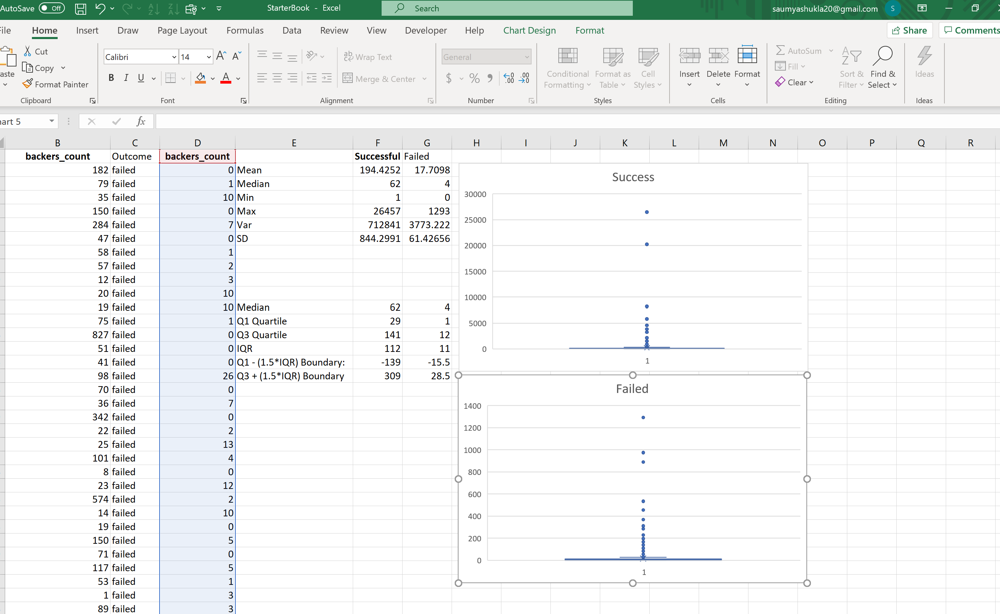

# Excel_Kickstarter_Analysis
## Analysis of Raw Data obtained from Kickstarter Project
403208
## Background
As part of Rutgers Data Analysis Bootcamp, students were asked to perform an analysis on a database of past 4000 Kicstarter(Crowdfunding Service) projects using Excel tools. The idea behind the exercise is to dig deep into raw data in order to obtain some pointers or tricks to achieve success in the projects and to obtain some Market trends.

## Lets get Started
* The starter file was first prepped up. Projects 'State'(Success, fail, Canceled and Live)  and 'Percent funded' were color coded using Conditional Formating. Colummns 'Category an Subcategory' was split for a better analysis.
## Pivot Tables and Graph plotted for Data Analysis
 
* The Piv.Table was created to estimate how many projects were Success, Failed, Canceled or Live on the basis of categories. Country filter was added to find out how many projects were launched as well thier state in each country.
 
 * Another Piv. table was created to analyse the 'state' in Sub Categories.'Country' and 'Parent Category' were used in filter.
 
* Here a Piv.table and Line Graph was created to understand if there was any effect of the launch time on the Success rate of the Project.
## Bonus 1

* New Sheet and a line chart was created to understand the influence of the goals's amount on the Success, failure, or cancellation of the projects.
## 2

* Mean, Median, Var and Standard Deviations were calculated on the backers count for Successful and Failed Campaigns.

## Results and Analysis
* Results are stored in a Excel file.

* A Word document comprising of Conclusions, Limitations and Additional Tables and Graphs is also made.  

